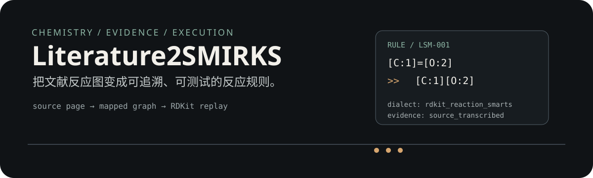

<p align="center">
  
</p>

Literature2SMIRKS 面向需要把有机合成文献转成反应规则的研究者：它先固定来源和页码，再恢复反应结构、建立原子映射，最后用 RDKit 回放并报告规则边界。

## 当前进度

- 已固定并哈希输入书籍：816 页，250 个命名反应条目。
- 已建立完整条目索引，保留 PDF 页码与印刷页码。
- 已建立前 100 条规则 demo scaffold；100/100 通过 RDKit 解析与正向 smoke test。
- 当前 100 条已绑定书中对应章节的页码、文本哈希和通式证据定位，状态为 `source_general_scheme`。它们仍不是逐图底物转录；只有 `source_transcribed` 记录才代表已恢复的结构实例。
- 正式发布前仍需对源图结构进行视觉核对、补充 `source_transcribed` 实例、检查原子映射、立体化学和范围外匹配。

## 最小运行路径

```powershell
python ops/prepare_source.py "C:\path\to\book.pdf"
python ops/read_source.py 56-65 --render
python ops/validate_demo.py
```

先看 `data/rules/rules_demo.json` 的字段和状态，再把源图核对过的实例加入 `source_transcribed` 规则集。模板解析成功只证明软件能执行这一结构变换，不证明论文中的实验条件或底物范围。

## 目录

```text
SKILL.md                       skill 入口
data/book_index.json           250 条书目索引
data/rules/rules_demo.json     100 条可执行 demo 规则
ops/prepare_source.py          固定输入并生成页级清单
ops/read_source.py             按页读取或渲染源文件
ops/validate_demo.py            RDKit 解析与回放 smoke test
docs/schema.md                 数据状态与证据语义
private/                       本地源派生物，已 gitignore
```

规则字段中的 `dialect` 必须保留。RDKit reaction SMARTS 与严格 Daylight SMIRKS 有语义差异；本项目不会用名称替代方言声明，也不会把模板解析成功解释为实验可行性证明。

## 许可与来源

本仓库只提交索引、规则数据、测试和处理脚本，不提交用户提供的 PDF 或其大段可替代文本。书籍来源：Laszlo Kürti、Barbara Czakó，*Strategic Applications of Named Reactions in Organic Synthesis*（Academic Press/Elsevier，2005）。
